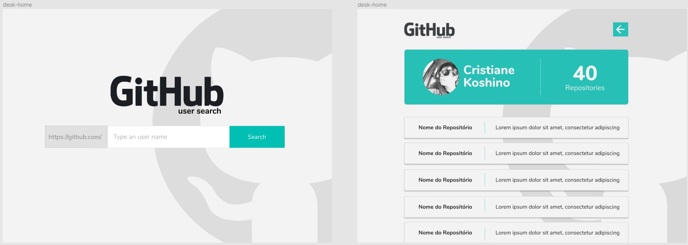

# <p align="center"> Github User Search </p>

<p align="center">

</p>

<p align="center">Project developed for lovelystay Challenge</p>

# Deploy
- [https://find-github-usersearch.netlify.app/](https://find-github-usersearch.netlify.app/)

# :pencil2: Features

* Search page
  - User can type an username to find a github profile
* User page
  - Github profile page with :
    * Picture
    * Name
    * Number of repositories
    * List of repositories

# :rocket: Technologies

* Javascript
* React
* HTML 5
* CSS 3 / SCSS
* Axios
* Jest

# :art: Layouts

 * [Figma](https://www.figma.com/file/ccDh3vxrNmU9lrrzJqETVy/layout?node-id=0%3A1)

### :computer: Web application

<p align="left">

</p>

### :iphone: Mobile

<p align="left">

</p>

#  :video_game: Run Application

### Run application

```bash
    #Install dependencies:
    $ npm install

    # Run application
    $ npm start
```
### Run tests

```bash
    # Run application
    $ npm test
```

# Other informations

- mobile first
